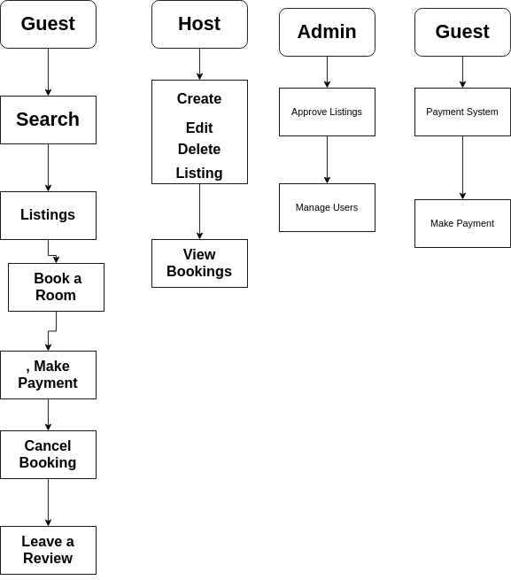

# Requirement Analysis in Software Development

## Introduction

Welcome to the **Requirement Analysis** repository. This project serves as a comprehensive guide to understanding the critical phase of **Requirement Analysis** in the **Software Development Life Cycle (SDLC)**. Whether you're a budding developer, seasoned engineer, or curious analyst, this repository aims to break down the fundamentals, significance, and practical activities of requirement analysis, using real-world examples.

---

## What is Requirement Analysis?

**Requirement Analysis** is the process of identifying, documenting, and managing the needs and requirements of stakeholders for a software system. It acts as the foundation for all future development phases by clarifying **what** the software should do and **how** it should behave.

This phase typically involves:
- Engaging with stakeholders to gather their expectations.
- Analyzing and prioritizing needs.
- Defining system boundaries.
- Creating documentation that guides developers, testers, and project managers.

### Importance in the SDLC:
- Sets clear project scope and goals.
- Reduces misunderstandings and costly rework.
- Provides a solid foundation for design, development, and testing.

Without thorough requirement analysis, projects risk scope creep, missed deadlines, or complete failure.

---

## Why is Requirement Analysis Important?

1. **Clarifies Stakeholder Expectations**
   - Helps bridge the communication gap between developers and stakeholders.
   - Ensures that the development team builds exactly what the client wants.

2. **Reduces Project Risks**
   - Identifies potential conflicts, gaps, or constraints early.
   - Minimizes the risk of rework or project failure.

3. **Improves Resource Management**
   - Helps in estimating time, cost, and effort accurately.
   - Supports better planning and allocation of development resources.

---

## Key Activities in Requirement Analysis

- **Requirement Gathering**
  - Collecting raw requirements from stakeholders via interviews, surveys, and observation.

- **Requirement Elicitation**
  - Proactively discovering the real needs behind the stated requirements through analysis and questioning.

- **Requirement Documentation**
  - Formalizing requirements in structured formats such as use case diagrams, user stories, or SRS (Software Requirements Specification).

- **Requirement Analysis and Modeling**
  - Identifying conflicts, redundancies, or gaps and refining requirements using models like DFDs, ERDs, or UML diagrams.

- **Requirement Validation**
  - Reviewing requirements with stakeholders to confirm accuracy, feasibility, and alignment with business goals.

---

## Types of Requirements

### Functional Requirements

These describe **what the system should do** — the specific behaviors, functions, or features.

#### Examples (Booking Management System):
- Users can search for available rooms using filters like date, location, and price.
- Hosts can create, edit, and delete property listings.
- Guests can make payments via integrated payment gateways like Stripe or PayPal.
- The system sends email confirmations upon successful booking.

### Non-functional Requirements

These define **how the system performs** its functions — related to usability, performance, scalability, and security.

#### Examples (Booking Management System):
- The application should load the search results within 2 seconds (Performance).
- The system must be available 99.9% of the time (Availability).
- All user data must be encrypted during transmission and storage (Security).
- The platform should support up to 10,000 concurrent users without performance degradation (Scalability).
- The user interface should be accessible to people with disabilities (Usability).

---

---

## Use Case Diagrams

**Use Case Diagrams** are a visual representation of the interactions between **users (actors)** and the **system's functionalities (use cases)**. They help in understanding the system’s behavior from the user's point of view and identifying the system's functional boundaries.

### 🔍 Benefits of Use Case Diagrams
- Provide a high-level overview of system functionality.
- Identify the different types of users and their interactions.
- Help developers, stakeholders, and testers align expectations.
- Aid in defining system scope clearly.

Below is a use case diagram for our Booking Management System:

---

## Acceptance Criteria

**Acceptance Criteria** define the conditions that a software product must satisfy to be accepted by a user, customer, or other systems. It ensures that requirements are clear, testable, and measurable.

### 🛠️ Why is Acceptance Criteria Important?
- Clarifies functionality before development starts.
- Prevents scope creep.
- Guides developers and testers.
- Serves as a reference for UAT (User Acceptance Testing).

### ✅ Example: Acceptance Criteria for Checkout Feature

**Feature:** Checkout Booking

**Acceptance Criteria:**
1. User must be logged in to proceed to checkout.
2. User must have selected valid booking dates and a listing.
3. Payment method (credit card, PayPal) must be selected.
4. Upon successful payment, a confirmation page with booking details is displayed.
5. A confirmation email is sent automatically.
6. If payment fails, an appropriate error message is shown, and the transaction is not processed.

---
